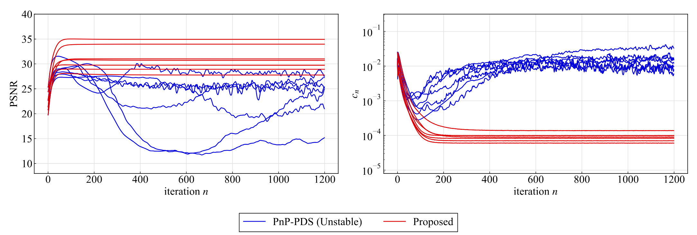

# General Deep Convergent Plug-and-Play Image Restoration Based on Primal-Dual Splitting  
Yodai Suzuki, Ryosuke Isono, and Shunsuke Ono  

MDI Lab, Institute of Science, Tokyo, Japan  

### Links
- [Conference proceeding (ICASSP 2024)](https://ieeexplore.ieee.org/document/10448023)
- [Preprint (arXiv)](https://arxiv.org/abs/2501.03780)
- [Project website](https://www.mdi.c.titech.ac.jp/publications/convergentpnppds)

## Abstract  
We propose a general deep plug-and-play (PnP) algorithm with a theoretical convergence guarantee. PnP strategies have demonstrated outstanding performance in various image restoration tasks by exploiting the powerful priors underlying Gaussian denoisers. However, existing PnP methods often lack theoretical convergence guarantees under realistic assumptions due to their ad-hoc nature, resulting in inconsistent behavior. Moreover, even when convergence guarantees are provided, they are typically designed for specific settings or require a considerable computational cost in handling non-quadratic data-fidelity terms and additional constraints, which are key components in many image restoration scenarios. To tackle these challenges, we integrate the PnP paradigm with primal-dual splitting (PDS), an efficient proximal splitting methodology for solving a wide range of convex optimization problems, and develop a general convergent PnP framework. Specifically, we establish theoretical conditions for the convergence of the proposed PnP algorithm under a reasonable assumption. Furthermore, we show that the problem solved by the proposed PnP algorithm is not a standard convex optimization problem but a more general monotone inclusion problem, where we provide a mathematical representation of the solution set. Our approach efficiently handles a broad class of image restoration problems with guaranteed theoretical convergence. Numerical experiments on specific image restoration tasks validate the practicality and effectiveness of our theoretical results.

## Summary of Theoretical Results


## Experimental Results
### Deblurring/Inpainting under Gaussian Noise

**The average PSNR [dB] values on seven images from ImageNet.**
| Method                        | Deblurring (σ=0.0025) | Deblurring (σ=0.005) | Deblurring (σ=0.01) | Deblurring (σ=0.02) | Deblurring (σ=0.04) | Inpainting (σ=0.0025) | Inpainting (σ=0.005) | Inpainting (σ=0.01) | Inpainting (σ=0.02) | Inpainting (σ=0.04) |
|-------------------------------|-----------------------|-----------------------|---------------------|---------------------|---------------------|-----------------------|-----------------------|---------------------|---------------------|---------------------|
| PnP-FBS                      | 31.28                | 31.16                | 30.59              | <u>28.26</u>        | 25.94              | - -                  | - -                  | - -                | - -                | - -                |
| PnP-PDS (Unstable)           | 23.79                | 23.67                | 23.78              | 24.60              | 23.35              | 33.65                | 33.36                | 32.79              | 31.51              | 29.58              |
| PnP-PDS (w/o a box const.)   | <u>37.23</u>         | <u>34.03</u>         | <u>31.00</u>       | 28.24              | **26.00**          | - -                  | - -                  | - -                | - -                | - -                |
| TV                           | 31.97                | 30.40                | 28.78              | 27.10              | 25.38              | <u>34.19</u>         | <u>33.90</u>         | <u>33.22</u>       | <u>31.90</u>       | <u>29.85</u>       |
| RED                          | 34.11                | 33.38                | 30.89              | **28.30**          | 24.87              | - -                  | - -                  | - -                | - -                | - -                |
| PnP-PDS (Proposed)           | **37.24**            | **34.04**            | **31.01**          | <u>28.26</u>        | **26.00**          | **35.61**            | **35.25**            | **34.43**          | **33.04**          | **31.00**          |

#### Visual Results


#### Comparison of Stability


### Deblurring / Inpainting under Poisson Noise
**The average PSNR [dB] values on three images from Set3.**
| Method                        | Deblurring (η=50) | Deblurring (η=100) | Deblurring (η=200) | Inpainting (η=50) | Inpainting (η=100) | Inpainting (η=200) |
|-------------------------------|-------------------|--------------------|--------------------|-------------------|--------------------|--------------------|
| PnP-ADMM                     | 25.16            | 26.28             | 26.55             | 11.45            | 27.87             | 28.10             |
| PnP-PDS (Unstable)           | 23.98            | 25.18             | 26.51             | **29.75**         | **31.90**         | **33.43**         |
| PnP-PDS (w/o a box const.)   | **25.17**         | <u>26.42</u>      | **27.77**         | **29.75**         | <u>31.21</u>      | <u>32.74</u>      |
| RED                          | 25.13            | 26.39             | 27.72             | 29.71            | 31.19             | 32.69             |
| PnP-PDS (Proposed)           | **25.17**         | **26.44**         | **27.77**         | **29.75**         | <u>31.21</u>      | <u>32.74</u>      |

#### Visual Results


#### Comparison of Stability


## Getting Started  

1. **Install Requirements**:  
   Use the `requirements.txt` file to install all necessary dependencies via `pip`.  

   ```bash  
   pip install -r requirements.txt  
   ```  

2. **Create Configuration File**:  
   - Update `config/setup.json` as needed for your environment.  

   **Example `setup.json`:**  

   ```json  
   {  
       "path_test": "/Users/xxx/",  
       "path_result": "/Users/xxx/",  
       "file_ext": "*.png",  
       "root_folder": "/Users/xxx/"  
   }  
   ```  

   **Fields**:  
   - `path_test`: Folder containing images to be restored.  
   - `path_result`: Folder where the experimental results will be saved.  
   - `file_ext`: File pattern for test images. This is case-sensitive.  
   - `root_folder`: Root directory where this project resides.  

3. **Set the Models**:  
   - Place the pretrained model in the `./nn` folder.  
   - In `main_gaussian.py` or `main_poisson.py`, set the filename to the variable `architecture`.  
   - The `.pth` files for the denoisers used in the proposed method are distributed [here](https://github.com/basp-group/PnP-MMO-imaging).  

4. **Test Run**:  
   - After setup, run `main_gaussian.py` or `main_poisson.py`.  
   - You can modify parameter values directly in each Python file.  

---  

## Citation  
```  
@INPROCEEDINGS{10448023,  
   author={Suzuki, Yodai and Isono, Ryosuke and Ono, Shunsuke},  
   booktitle={ICASSP 2024 - 2024 IEEE International Conference on Acoustics, Speech and Signal Processing (ICASSP)},   
   title={A Convergent Primal-Dual Deep Plug-and-Play Algorithm for Constrained Image Restoration},   
   year={2024},  
   volume={},  
   number={},  
   pages={9541-9545},  
   keywords={Signal processing algorithms;Artificial neural networks;Signal processing;Robustness;Acoustics;Image restoration;Task analysis;Image restoration;plug and play (PnP);primal-dual splitting (PDS)},  
   doi={10.1109/ICASSP48485.2024.10448023}  
}  
```  